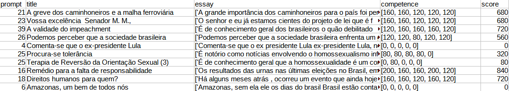

# Aluno
* 155077: Daniel Credico de Coimbra

# Análise do Artigo "Essay-BR: a Brazilian Corpus of Essays"

| campo | valor |
|------------|----------------------------------------|
| referência | MARINHO, J. C.; ANCHIÊTA, R. T.; MOURA, R. S. 2021 |
| link       | https://github.com/rafaelanchieta/essay |
| dataset | https://github.com/rafaelanchieta/essay/blob/master/essay-br/essay-br.csv |
| formato | CSV (comma-separated values) |

## Resumo

O dataset Essay-BR compila em uma tabela um total de 4570 dados não-estruturados (textos em formato de ensaios argumentativos) produzidos por alunos brasileiros de ensino médio em plataformas digitais entre 2015 e 2020. Cada texto foi manualmente avaliado por especialistas em redação, com as avaliações e o gênero do texto informados no dataset. A avaliação ocorreu por uma nota de 0 a 200 (em intervalos de 40) em cinco dimensões de competência, conforme os critérios de avaliação do ENEM: aderência à norma culta, adequação ao gênero, articulação argumentativa, capacidade de análise, e capacidade de solução. A mesma redação é avaliada por múltiplos especialistas, existindo critérios para lidar com desacordo significativo entre os especialistas. O formato do dataset pode ser visto abaixo.

## Perguntas de pesquisa/análises

* É possível automatizar a correção de ensaios em linguagem natural?
* Ou, pelo menos, usar métodos computacionais para auxiliar especialistas na correção?
* Quais as dificuldades específicas apresentadas pelo português?
* Quais as competências nas quais os alunos se saem melhor?
* Há diferenças regionais nas competências demonstradas pelos alunos?
* Qual a evolução temporal das competências médias dos alunos?
* Poderia-se gerar ensaios automatizados a partir de um algoritmo de aprendizado de máquina que teve como input os artigos em Essay-BR?

## Trabalhos relacionados
Dentre os artigos citados no artigo sob discussão, destacamos alguns diretamente pertinentes ao tópico.
* Amorim, E. et al. "Automated essay scoring in the presence of biased ratings", 2018.
* Bazelato, B. & Amorim, E. "A bayesian classifier to automatic correction of portuguese essays", 2013.
* Fonseca, E. et al. "Automatically grading brazilian student essays", 2018.
* Ke, Z. & Ng, V. "Automated essay scoring: a survey of the state of the art", 2019.
* Williamson, D. "A framework for Implementing Automated Scoring", 2009.