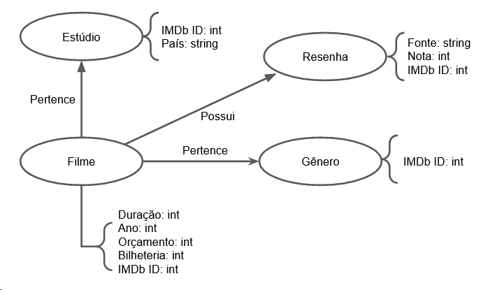

# Aluno
* 155077: Daniel Credico de Coimbra

## Modelo Lógico do Banco de Dados de Grafos

## Perguntas de Pesquisa/análise
* Quais os gêneros mais distantes? (Onde distância é medida pelo menor número de filmes necessário para ir de um gênero a outro)
* Quais os estúdios mais colaborativos? (Onde colaboratividade é medida pelo número de filmes produzidos juntos)
* Quais os estúdios com maior variedade temática? (Onde variedade temática é medida pelo inverso da soma do menor caminho do estúdio até o gênero)